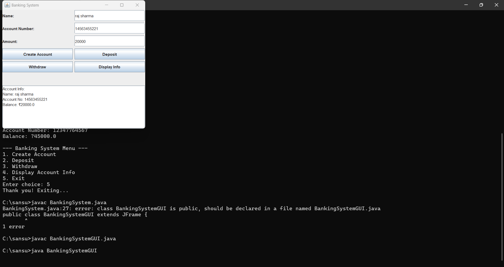

# 🏦 Java GUI Banking System

A simple **Banking System with a GUI** using **Java Swing**.  
You can create accounts, deposit or withdraw money, and view account details.  
All data is saved in a text file (`accounts.txt`) so your info remains between sessions.

---

## 🚀 Features

- 🖥️ Simple GUI using Java Swing
- ✏️ Create new bank accounts
- 💰 Deposit and withdraw
- 📄 View account info
- 💾 Persistent storage in `accounts.txt`

---

## 🔧 Requirements

- Java JDK 8 or higher
- Any IDE (like IntelliJ, Eclipse, VS Code)

---

## 📁 Project Structure

```text
.
├── BankingSystemGUI.java     // Main GUI file
├── accounts.txt              // Stores account data
├── README.md                 // You're here!
```

---

## 🧠 Concepts Covered

- Java Swing (GUI)
- Object-Oriented Programming
- File I/O
- ActionListeners
- Error handling
- Text file data management

---

## 📥 How to Run

1. Open the project in your IDE or terminal.
2. Compile:
   ```bash
   javac BankingSystemGUI.java
   ```
3. Run:
   ```bash
   java BankingSystemGUI
   ```

4. Use the interface to:
   - Create account
   - Deposit/withdraw
   - View account details

---

## 📸 Preview

 

---

## ✨ Sample Data (accounts.txt)

```text
Sanskriti,101,5000.0
Aarav,102,1200.0
Diya,103,300.0
```

---

## 🪄 License

Open-source for learning and development. Feel free to fork and build on top of it! ✨

---

## 🙋‍♀️ Author

**Sanskriti**  
💌 [Contact me if you want help or want to collaborate!]
